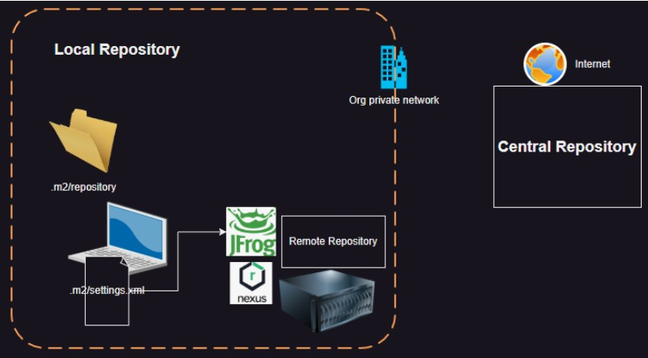
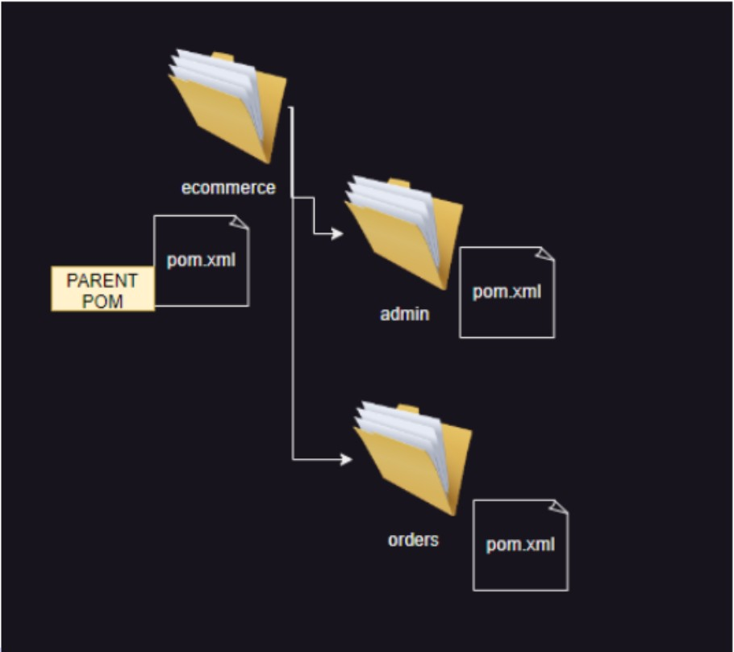
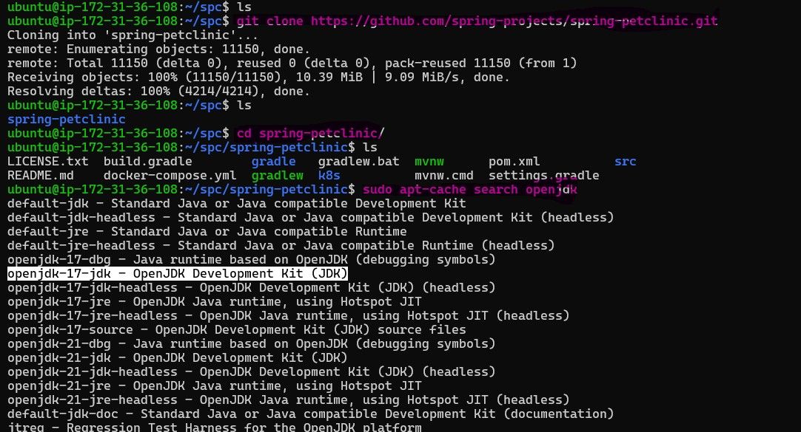
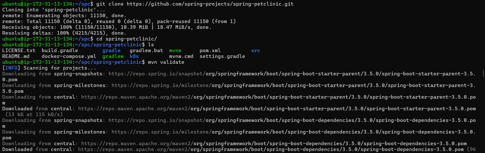
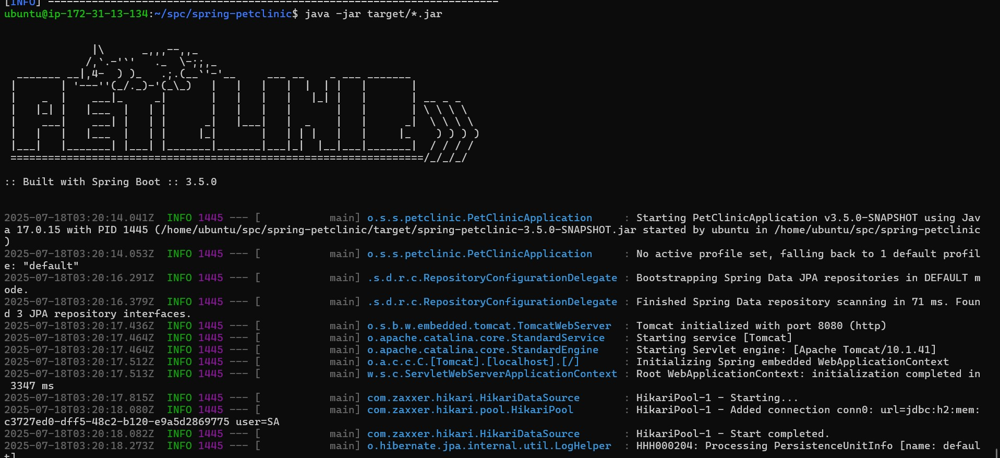
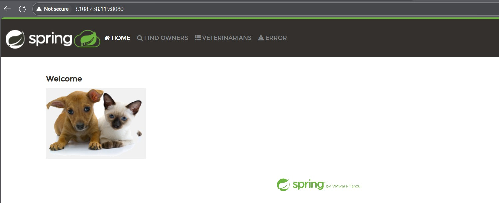

# Build 
   
step by step to **build your project** using DevOps practices. 

---

### ✅ Step 1: Understand Your Project

Please share the following details:

1. **What kind of project is it?**

   * Java, Python, Node.js, PHP, etc.?
   * Monolithic or microservices?
   * Frontend + Backend?

2. **Where is the code?**

   * GitHub / GitLab / Bitbucket?
   * If private, do you have access?

3. **What is your goal?**

   * Just build the code?
   * Build + Test?
   * Full CI/CD (Build, Test, Deploy automatically)?

---

Once I have this, we’ll follow this typical DevOps path:

---

### 🚀 DevOps Project Flow (Simplified)

| Step | Stage                           | Tool                             | What It Does                              |
| ---- | ------------------------------- | -------------------------------- | ----------------------------------------- |
| 1️⃣  | **Source Code Management**      | Git + GitHub                     | Store and manage your code                |
| 2️⃣  | **Build**                       | Maven / Gradle / npm / pip       | Convert source code into a build artifact |
| 3️⃣  | **CI (Continuous Integration)** | Jenkins / GitHub Actions         | Automatically build and test code         |
| 4️⃣  | **Dockerization**               | Docker                           | Package app into containers               |
| 5️⃣  | **Image Storage**               | Docker Hub / ECR                 | Save and share Docker images              |
| 6️⃣  | **Deployment**                  | Kubernetes / EC2 / Azure / Local | Run the app on a server                   |
| 7️⃣  | **Monitoring**                  | Prometheus + Grafana (optional)  | Track health of the app                   |

---

### 📘 Example Scenario (Java + Jenkins)

Let’s assume a **Java Maven project** stored in **GitHub**, and you want to build and deploy it with **Jenkins** and **Docker**.

Here’s the high-level step plan:

1. ✅ Clone code from GitHub
2. 🔨 Build using Maven
3. ✅ Configure Jenkins for CI
4. 🐳 Create Dockerfile to containerize the app
5. 📦 Push Docker image to Docker Hub
6. 🚀 Deploy container on your server or local machine
7. 📈 (Optional) Add monitoring later

---


### Set environment variable
  * `sudo vi /etc/environment`
      * set in last there is a `games:/snap/bin:/opt/apache-maven-3.9.8/bin"` 

# Maven is Build tool 
 
* __Make__: 

 * This is a first generation build tool which has automated building of c and c++ projects.
 * The build steps are configured in a file which is called as Makefile
 * To work with maven we need the pom.xml (Project object model)  ---For writing this pom.xml writing this there is schema this written by Developer we dont need to write this .

* __Apache Ant__:
 
  * This is a build tool majorly used in Java Projects for building packages
  * The build steps are configure in a file called as build.xml

* __Apache Maven__:

  * Maven is a build tool used for java and java based languages (Groovy and Scala).
  * Maven belives in convention over configuration
  * Maven helps in
    * Building 
    * Testing
    * Packaging 
    * managing dependencies.

  * Maven has a standard directory layout 
  * Maven has archetypes using which we can generate folder structures with sample code.
  * To Write this pom.xml need to define projectlike

# Setup Maven

 * Maven relies on java, so java should be installed
 
 ```
 sudo apt update
 sudo apt install openjdk-17-jdk -y
 ```

 # Project Object Model 

  * [Refer](https://maven.apache.org/guides/introduction/introduction-to-the-pom.html)
  
* Lets use untar approach to install maven (3.9.8)
* reference article
[Refer](https://www.digitalocean.com/community/tutorials/install-maven-linux-ubuntu)
 
 * Simple pom.xml
 * Any java base project we can use maven. in this project we need to do change we want:
```xml
 * Simple Pom.xml
<project>
  <modelVersion>4.0.0</modelVersion>
  <groupId>io.lerningthoughts.app</groupId> 
  <artifactId>hello-maven</artifactId>
  <version>1.0.0-SNAPSHOT</version>          
</project>
```
```md
* Name of organisation or group
* Artifact id means what the project about.
* SNAPSHOT  means this project is under development still  | RELEASE means this project is complited.
* This Above content in the pom.xml file .
* so we  using java programing language so the second file should be in `src\main\java\io\learningthoughts\devops\main.java.`
```

* As a DevOps Engineer your intrest should be only in `.jar` file  coz this is something i will deploy idealy, this is my package . 

# There is 3 very popular format `.jar .war and .ear`

* the entire explanation about `.jar`, `.war`, and `.ear` formats in markdown (`.md`) format:

```md
# Explanation of `.jar`, `.war`, and `.ear` Files  
  * `.jar` file is nothing but a `zip` file. 

In the world of Java and DevOps, you'll often hear about three main file formats for packaging and deploying applications: `.jar`, `.war`, and `.ear`. Here’s what each means.

## What Are They?

All three are just **special zip files** that bundle up the code and files your application needs, but *what* they bundle and *where* you run them is different.

| Format  | What it Stands For    | Main Use                                | Where Is It Used?              |
|---------|-----------------------|---------------------------------------|-------------------------------|
| `.jar`  | Java ARchive          | Standalone Java applications or libraries | On any computer with Java    |
| `.war`  | Web Application ARchive| Java web apps (like websites or APIs) | On web/application servers    |
| `.ear`  | Enterprise ARchive    | Big enterprise apps, containing multiple components | On advanced enterprise servers |

## Explaining Each One Simply

### `.jar` (Java ARchive)
- Think of it as a **box of Java code, libraries, and resources**.
- Used for **standalone applications** or as reusable code libraries.
- You can run some `.jar` files directly using:
  ```md
  java -jar MyApp.jar
  ```
- Needs only basic Java installed on the system.

### `.war` (Web Application ARchive)
- **For web apps**: packages everything needed for a website or API (Java code, HTML, CSS, etc.).
- Always contains a special folder called `WEB-INF` (where web config and security info go).
- You **cannot run a `.war` file by itself**. It needs a web server (like Tomcat) to function.
- Used when deploying Java-based websites to application servers or the cloud.

### `.ear` (Enterprise ARchive)
- **For big, company-level apps**: often contains several `.jar` and `.war` files packed together.
- Deployed to *enterprise-grade* servers (like JBoss or WebSphere), which can run very complex systems.
- Useful for businesses needing lots of connected apps (like web portals, background workers, email, etc.) managed as one.
- You can’t run an `.ear` file on your own computer; it’s for specialized servers.

## Very Quick Table

| File Type | Contains                | Used For           | Needs?                 | Can run by itself?      |
|-----------|-------------------------|--------------------|------------------------|------------------------|
| `.jar`    | Java code, libraries    | Utilities, tools    | Java installed         | Yes (`java -jar`)      |
| `.war`    | Web app + resources     | Websites/APIs      | Application server     | No                     |
| `.ear`    | `.jar` + `.war` files   | Enterprise systems | Enterprise app server  | No                     |

## In DevOps Context

- DevOps pipelines (like Jenkins or GitHub Actions) **automate the packaging** of your application into one of these formats for easier, error-free deployment.
- You usually don’t create them by hand; your build tools (Maven, Gradle) do it for you.

## Summary 

- If you’re making a **Java tool or utility**: package as a `.jar`.
- If you’re building a **website or API** in Java: package as a `.war`.
- If your company has a big, complex system using multiple web/apps: package as a `.ear`.

You’ll “deploy” (publish) these files to the appropriate server so others can run or access your app.

---

**Quick Visual Reminder:**

- **JAR** = Java code (standalone)
- **WAR** = Web App (website/API)
- **EAR** = Enterprise App (lots of parts together)

# Distributed Build: 
   
   * A distributed build is a process where the tasks involved in building software—such as compiling code, running tests, or packaging artifacts—are divided and executed across multiple machines or nodes in a network. This approach is designed to speed up the build process, especially for large codebases or complex projects, by leveraging parallel processing and optimizing resource utilization

* __To add other nodes to the Jenkins master node, the other nodes need to have `openjdk-17-jdk` installed.__

* __To Configur Other node With Jenkins node add other node '`private ip` all three nodes are on same network os use private ip'__

  * For This We use `ssh -i jenkins.pem ubuntu@<private_Ip_of_othernode>` and for this we need this [.pem] which install on local system need this on jenkins system node.
  * So add this [.pem] file go in jenkins master Dashboard and to changes 
          * Location ware to add --->  `Dashboard>Manage jenkins>Credentials>System>Global credentials(unrestricted)`


  [After_This_We_get_the_key_file_which_we_save_in_the_local_node_Till_this_We_just_added_pemfile_key]


## Now Add the Nodes bases on that .pem file key

  * Location Ware to add --> `DashBoard > Manage jenkins > Nodes > New node`


## After Add .pem File on the jenkins master node and also after adding the node to it Now Perform some build on the nods

# This Following Task for `spc node`

  * using the lable we need to build the project in node

  * Creat a Freestyle project 1st >>> it take you in Configuration >>> General 
    `Restrict where this project can be run ?` In this session mention the label.\

# This Following Task for `Nop node` 

  * Same Create One new Project for Nop node  With dotenet  create a new log view name of freestyle nop-freestyle >> Configuration

  * In Configuration build the code  From git 

# To create Artifact of build This get install in nop node 


  * To Create a Artifact of the build go in Build Step > Execute shell 
      In that shell run this command `mkdir published `
                                     `ndotnet publish -c Release src/Presentation/Nop.Web.csproj -o ./published/` Try to move your output here.

    * Now Mention this published folder in Archive the  rtifacts in post-build Action.
          `published/*`  -> it means add any thing

  * It's Artifacts create hole folder we need to zip those folder
  Install zip if its not install 

  * It create a Artifacts of nop-freestyle in  published folder So zip those file inside published folder. from terminal using command `zip -r Nop.Web.Zip published/`

  * Create a new to delete the workspace and also include this commad in the Execute shell `zip -r Nop.web.zip published folder/` ans archive Nop.web.zip


# Maven Lifecycle 
  
   ```
     validate
     compile 
     test 
     package 
     install = try to copy your package into your local repository
     deploy  = this is not deploying to the server, sending artifacts to some other location 
     
   ```

* Any result of the build is called Artifacts.

* `sudo ufw allow 8080` If Jenkins or any other service is running on port 8080, this command permits external devices to access it via that port.
* Use this command only if the UFW firewall is enabled on your system and you want to allow remote access to services on port 8080.
* By default, UFW blocks incoming connections, so you must explicitly allow required ports for external access

* opens port 8080 in your Ubuntu firewall managed by UFW (Uncomplicated Firewall). This allows incoming network connections to your machine on port 8080, which is commonly used by applications like Jenkins, Tomcat, and some web apps.
 

# Information about maven 

 * Maven will create a folder called as target and add all artifacts into it.
 * clean step removes the target folder
 * When we install maven in the home directory (C:\Users<username>\ or /home/created).
 * This .m2 folder will have all the dependencies downloaded over here and is also referred as local repository.
 
 * In maven we deal with 3 repositories
    * local
    * remote
    * central 



Let’s break down JFrog Artifactory, Nexus, and Azure DevOps Artifacts in plain language with real-life style context, so you understand not just what they do, but how they feel to use.

## What Are They?

Think of all three as **digital libraries for your software team's building blocks**. When you build your app, the process creates "artifacts" (like JAR files, Docker images, npm packages). These tools **store** and **share** those artifacts—so your whole team always pulls from a safe, reliable, and versioned place.

## How Do They Feel to Work With?

|                | JFrog Artifactory                                 | Nexus Repository                                  | Azure DevOps Artifacts                               |
|----------------|---------------------------------------------------|---------------------------------------------------|------------------------------------------------------|
| **Main Idea**  | Huge, universal library supporting almost all types of build output; great for complex needs. | Simple, robust, and especially strong for Java teams; reliable and easy to run yourself. | Integrated, easy-to-use package sharing inside Azure DevOps.                |
| **Best For**   | Teams working across many languages and tech; large orgs needing advanced features, security, and scalability. | Java-centric or smaller teams who like to self-host and want open-source options. | Anyone already using Azure DevOps for their builds, releases, boards, etc.   |
| **Cloud/On-Prem?** | Both, you choose (cloud, on-prem, or hybrid).   | Usually self-hosted/on-prem, but some cloud options. | Cloud only—hosted by Microsoft within Azure DevOps.   |
| **Example**    | - Company building a microservices app in Java, Node.js, and Python: stores Docker images, PyPI wheels, npm packages all in one place.- Needs advanced security: JFrog handles malware scans on each artifact. | - Startup building a Java web app: Nexus stores all its Maven artifacts, and it’s completely free to run locally.- Open-source projects: Nexus proxies open-source repositories (like Maven Central) for faster, controlled access. | - Team building a .NET app and React frontend: Publishes NuGet and npm packages right into Azure Artifacts feed; easy to set access so only certain teams can use "beta" packages.  |
| **Cool Feature** | Advanced metadata, promotion workflows, security scans (with Xray). | Simple structure, robust REST APIs, strong for Java, reliable and fast. | Seamless with Azure pipelines, boards, repos, and identity management.        |

## When Should You Use Each One?

**Pick JFrog Artifactory if…**
- You have a lot of different kinds of apps and languages; you need "one repository to rule them all".
- You care about deep metadata, tracing who built what, strict security, and maybe global distribution.

**Pick Nexus if…**
- You work mostly with Java or want an easy, open-source, and free option.
- You want decent features but don't need every fancy enterprise option.

**Pick Azure DevOps Artifacts if…**
- Your code and teams already live in Azure DevOps (pipelines, boards, repos).
- You want super-simple permissions and don’t need to manage servers.
- You only need to support major formats (NuGet, npm, Maven, Python), not lots of obscure types.

## Real-World Example Scenarios

- **Big Enterprise**: Builds microservices in Go, Java, Python, and JS. Needs gov-compliant, high-security, and multi-site artifact replication—**picks JFrog Artifactory**.
- **Small SaaS Startup**: Does pure Java or JavaScript work and wants to self-host with low cost—**picks Nexus**.
- **Corporate Team Already on Azure**: Uses Azure Boards and Releases, wants everything in one place with easy user management—**picks Azure DevOps Artifacts**.

Here’s a hands-on, human-friendly look at how JFrog Artifactory, Nexus, and Azure DevOps Artifacts work in real-world development, using clear examples and analogies.

## 1. JFrog Artifactory

### What is it?
- Think of it as a **huge digital warehouse** for all the things your dev teams build: code packages, Docker images, machine learning models, and more.
- Supports a ton of formats: Maven, npm, PyPI, Docker, Helm, etc.

### Real Example:
- Imagine a large company with dozens of microservices written in Java, Node.js, and Python. Each time a team builds a new version, the build process creates files: `.jar`, `.whl`, `.tgz` (npm), Docker images.
- **How it helps:** All these files go neatly into Artifactory, versioned, labeled, and ready to share. Another team working on deployment can just pull the exact Docker image they need, knowing it’s the right, tested version.
- **Advanced Features:** With JFrog Xray, you can automatically scan files for vulnerabilities so no one accidentally promotes a buggy or insecure package to production. Artifactory also enables teams in different regions to mirror artifacts for speed and reliability.

## 2. Nexus Repository

### What is it?
- A **trusted library** mostly used and loved by Java-heavy teams, but it supports more formats now (npm, Docker, NuGet, and others).
- Can be self-hosted (free version) or run as an enterprise product.

### Real Example:
- A startup is building a Java app using Maven. Every ‘build’ step downloads lots of code (‘dependencies’) from the internet, which is slow and inconsistent.
- **How it helps:** With Nexus, after the first download, dependencies are cached locally in Nexus. All future builds are super fast and reliable—no internet hiccups. You can also place your own internal “secret” libraries that aren’t shared outside the company.
- **Docker use:** The startup later adopts Docker. Now, Nexus can also store Docker images, so deployment servers can quickly pull exactly the right container image, with version control and role-based access[5][6].

## 3. Azure DevOps Artifacts

### What is it?
- Think of this as **easy cloud shelves** for your build outputs, deeply integrated into Azure DevOps (Microsoft's all-in-one development suite).
- Supports NuGet (.NET), npm (JavaScript), Maven (Java), Python, and Universal Packages.

### Real Example:
- A corporate team builds .NET web applications and TypeScript frontends. With every build in Azure DevOps Pipelines, their libraries and app packages are published to Azure Artifacts.
- **How it helps:** Other teams or later pipeline stages can just “consume” these packages directly—no copies, no email attachments. You can restrict who gets early access to packages (say, only QA or preview customers).
- **Integration:** Since it's part of Azure DevOps, managing access is easy with Azure Active Directory, and actions like build, test, store, release are all in one system[1][6].

## Key Features at a Glance

| Feature/Scenario       | JFrog Artifactory            | Nexus Repository        | Azure DevOps Artifacts      |
|------------------------|------------------------------|------------------------|-----------------------------|
| **Package formats**    | 40+ (very broad!)            | Good, Java-strong      | Only mainstream, mostly MS  |
| **Free/Self-host?**    | Yes, but advanced features paid | Yes, strong free OSS  | Free up to 2GB, cloud only  |
| **Cloud Support**      | All clouds and hybrid        | Can self-host, some cloud | Microsoft Azure only     |
| **Special Power**      | Security scans, geo-replication, metadata | Simplicity, great for Java, fast proxy | Cloud integration, easy permissions |
| **Best for**           | Big/diverse companies, security-focused | Java or OSS-centric teams  | Teams already 100% in Azure DevOps  |

## TL;DR – How A Team Chooses

- **Enterprise with complex tech & global users:** Artifactory for scale, features, security.
- **Java-centric, open-source-friendly team or startup:** Nexus for simplicity, low cost, and stability.
- **Microsoft shop already using Azure Pipelines/Repos:** Azure Artifacts for convenience and deep integration.

## Handy Analogies

- **Artifactory:** The shopping mall with every possible store and special security at the entrance.
- **Nexus:** Your local library – simple, reliable, with everything you need if you’re not into exotic stuff.
- **Azure Artifacts:** Special storage lockers inside your company’s office, easy for everyone there to use with their IDs.

By managing, versioning, and sharing your software “building blocks,” these tools make releases faster, safer, and more reliable, letting your developers focus more on features and less on the headaches of “where’s that file?”

## Final Thoughts

Each of these tools does the core job: storing, organizing, and sharing the apps, libraries, and images your team builds. The real difference?  
- **Breadth of features** (JFrog = biggest),
- **Simplicity and cost** (Nexus = easiest, cheap/free),
- **Integration** (Azure DevOps Artifacts = part of a bigger family, great if you’re all-in on Azure).

You can even integrate JFrog or Nexus into Azure DevOps pipelines if you want the best of both worlds


---

### ✅ **What is a Parent POM in Java/Maven?**

In **Maven**, the `pom.xml` file is like a recipe 📜 that tells how to build your project — what tools to use, which versions, dependencies, etc.

A **Parent POM** is like a **master recipe** 👨‍🍳 that many smaller recipes (projects) follow.

---

### 👨‍💼 **Real-Time Example: Company Microservices**

Suppose you're working at a company that has multiple services:

```
CompanyProject/
├── parent-pom (common settings) ✅
├── service-user (login system)
├── service-orders (order tracking)
├── service-payments (payment gateway)
```

Each service has its own code and `pom.xml`, but instead of writing the same things again and again (like plugin versions, Java version, dependencies), we do this:

---

### 👇 What goes into the **Parent POM**?

📦 Define **Java version** (e.g., Java 17)
⚙️ Define **build plugins** (e.g., Maven Compiler Plugin)
📚 Define **common dependencies** (like Spring Boot, Log4j, etc.)
🧪 Define **test rules**

Now, each service can just say:

```xml
<parent>
  <groupId>com.company</groupId>
  <artifactId>parent-pom</artifactId>
  <version>1.0.0</version>
</parent>
```

And **BOOM! 💥** — they get all the shared configs automatically!

---

### 🧑‍🔧 Now in Jenkins:

When you configure a Jenkins job to build `service-user`, it reads its `pom.xml` → sees the parent → and Jenkins automatically uses all the shared settings from the **parent POM**. So:

* ✅ No need to define plugins separately for each project
* ✅ Consistent builds across all services
* ✅ Easier to maintain and update (just change parent once)

---

### 🤝 Summary:

| Term                | Meaning                                                 |
| ------------------- | ------------------------------------------------------- |
| `parent-pom` 👨‍👧  | Master config file shared across many Java projects     |
| `child-pom` 👶      | Individual project that uses settings from the parent   |
| **Jenkins role** 🧰 | Just runs the build. Maven + Parent POM handle the rest |

---

| Tool & Emoji     | Typical Use Case Scenario                                                                                   |
|------------------|-----------------------------------------------------------------------------------------------------------|
| 🐘 **Gradle**    | Building a complex Android app or a large Java microservices system. *Scenario:* A fintech startup chooses Gradle for its flexibility, speed, and plugin system to build, test, and package dozens of interconnected Java modules in seconds. |
| ☕ **Maven**      | Managing dependencies and builds for large-scale enterprise Java applications. *Scenario:* A bank’s backend team uses Maven to ensure standardized builds and dependency management for its suite of Java web services.                         |
| 🐜 **Ant**        | Custom, fine-tuned build logic for legacy Java projects or migrating legacy systems. *Scenario:* A telco maintains older applications using Ant’s XML scripts, customizing every build/test/package step due to unique historical needs.         |
| 🏗️ **CMake**     | Compiling C/C++ cross-platform projects, from desktop to embedded. *Scenario:* A robotics research lab uses CMake to manage and build C++ code that must run on both Windows laptops and Linux-based robots.                                |
| 📦 **npm**       | Building and distributing modern web apps and Node.js backends. *Scenario:* A digital agency bundles and deploys their React SPA and Node API using npm scripts and packages, running `npm run build` for each deployment.                      |
| 🧶 **Yarn**      | Faster, more reliable JavaScript builds with workspaces. *Scenario:* An e-commerce platform with dozens of JS/TS packages uses Yarn workspaces to develop, test, and publish UI and shared libraries together, consistently.                    |
| 🏎️ **Bazel**    | Massive codebases (monorepos), multiple languages, fast & reliable builds. *Scenario:* A cloud provider uses Bazel to keep builds quick and consistent for thousands of engineers working on interconnected Java, Go, and Python projects.       |
| 🚀 **Jenkins**   | Automating builds/tests as part of CI/CD pipelines. *Scenario:* A healthcare SaaS company sets up Jenkins to automatically build, test, and deploy updated code to staging and production, ensuring every commit is tested before release.       |
| 🔧 **SBT**       | Building Scala and JVM-based backend services. *Scenario:* A data engineering team at a social network relies on SBT for compiling, testing, and packaging its big data processing jobs for Apache Spark.                                    |
| 🐋 **Docker**    | Packaging and shipping applications as containers. *Scenario:* A startup automates Docker image builds for its Node, Python, and Go microservices, ensuring code always runs on every developer and server the same way.                        |

## More Real-World Scenarios

- **Gradle**: A gaming company manages hundreds of reusable Java modules and assets for different game engines with Gradle, leveraging its incremental build speed.
- **Maven**: An enterprise releases monthly updates to a core banking app; Maven ensures everyone on the team builds against the exact same library versions.
- **npm**: A developer runs `npm install` to get all dependencies then uses `npm run test` to run automated tests before each Git push.
- **Bazel**: A tech giant’s monorepo holds backend APIs (Java), machine learning (Python), and deployment scripts (Go); Bazel guarantees quick, cacheable builds and avoids broken dependencies across thousands of components.

These tools streamline building, testing, and deploying software, turning source code into ready-to-go apps—efficiently and reliably.


# Building Sample Project

  * we have installed jdk 17
  * Lets build [Refer](https://www.geeksforgeeks.org/installation-guide/how-to-install-openjdk-in-linux/)
  
```
git clone https://github.com/jenkins-docs/simple-java-maven-app.git
cd simple-java-maven-app
mvn validate 
mvn compile 
mvn test 
mvn package 
```

# Lets build spring pet clinic

```
 history
    1  sudo apt update

    2  sudo apt install openjdk-17-jdk -y
      right click on link and copy link and then  `wget https://dlcdn.apache.org/maven/maven-3/3.9.11/binaries/apache-maven-3.9.11-bin.tar.gz`

    4  sudo tar -xvzf apache-maven-3.9.11-bin.tar.gz -C /opt/
    5  cd /opt
    6  sudo ln -s apache-maven-3.9.11 apache-maven
    7  sudo nano /etc/profile.d/maven.sh
      ```
      export M2_HOME=/opt/apache-maven
      export MAVEN_HOME=/opt/apache-maven
      export PATH=${M2_HOME}/bin:${PATH}

      ```
    8  ls
    9  sudo chmod +x /etc/profile.d/maven.sh
   10  source /etc/profile.d/maven.sh
   11  mvn -version
   12  cd
   13  mvn -version
   14  ls
   15  history
```
 

``` 
do this in terminal
-------------------

git clone https://github.com/spring-projects/spring-petclinic.git
cd spring-petclinic
mvn clean package 
```







| Command             | Lifecycle Phase  | What It Does                                                           | Output/Effect                                       |
|---------------------|------------------|-----------------------------------------------------------------------|-----------------------------------------------------|
| `mvn validate`      | validate         | Checks project structure and config (like `pom.xml`)                  | Detects config errors early                         |
| `mvn compile`       | compile          | Compiles source code in `src/main/java`                               | `.class` files in `target/classes`                  |
| `mvn test-compile`  | test-compile     | Compiles test code in `src/test/java`                                 | Test `.class` files in `target/test-classes`        |
| `mvn test`          | test             | Runs unit tests after compiling test code                             | Test result reports                                 |
| `mvn package`       | package          | Packages compiled code as JAR or WAR file                             | JAR/WAR in `target/`                                |
| `mvn verify`        | verify           | Runs additional checks (integration tests, etc.)                      | Optional checks completed                           |
| `mvn install`       | install          | Installs artifact to your local Maven repository (`~/.m2/repository`) | Can be used as a dependency locally                 |
| `mvn deploy`        | deploy           | Uploads artifact to a remote Maven repository                         | Used for releases/distribution                      |
| `mvn clean`         | clean            | Removes the `target` directory and build artifacts                    | Cleans up all generated files                       |
                     |






# Multi-project model: 

* Try building game-of-life : [Refer](https://github.com/wakaleo/game-of-life.git)

* __References:__ 

  * __Libraries__ Library is a collection of reusable code. It helps Developers avoid writing the same code again and again. It can use Library to perform common tasks to connecting to database, sending emails or loggin. 
      * __Libraries are of two types__
          * __static library__ 
                * Code is copied into your program when you compile it.
                * The final file (like .exe) contains everything, including the library.
                * No need for the library at runtime — it’s already part of the program.
                * File extensions:
                * Windows: `.lib`
                * Linux: `.a`
          * __Dynamic Library (Shared Library)__
                * Code is not copied during compilation.
                * Linked at runtime — the program depends on the external library file.
                * Smaller executable size.
                * File extensions:
                * Windows: `.dll` (Dynamic Link Library)
                * Linux: `.so` (Shared Object)
          *  Advantage: Smaller file size, easy to update the library without recompiling your code.
          *  Disadvantage: If the library is missing or changed, your program may crash.

🧩 Summary Table:

| Feature         | Static Library   | Dynamic Library      |
| --------------- | ---------------- | -------------------- |
| Linking Time    | Compile Time     | Run Time             |
| File Size       | Larger           | Smaller              |
| Performance     | Faster           | Slightly Slower      |
| Update Library? | Recompile needed | No need to recompile |
| Extensions      | `.lib` / `.a`    | `.dll` / `.so`       |

 
 * Dependency: Dependency at a source code level, means relying on libraries to acheive some funtionility. 

* __Modern build tools__: Modern build tools help automate and manage the process of building software. 
      * Think of them like assistants that handle:
        * Compiling code
        * Managing required libraries (dependencies)
        * Creating final packaged files (artifacts)
        * Keeping track of versions
    
     * __build code__ 
           * This means compiling source code `(like .java, .cpp, or .ts files)` into executable files `(like .jar, .exe, etc.)`.
           * The build tool runs all the steps: compiling, testing, packaging.
           * Example:
             * Java → `.java` files compiled into `.class`, then packaged into `.jar` using Maven or Gradle
 
     * __dependency management__ 
           * Most projects depend on external libraries `(like JUnit for testing, Spring Boot, etc.)`.
           * Build tools automatically download and include these libraries, so you don’t have to do it manually.
           * Example:
              * In Maven, you write this in `pom.xml`:
               
                ```xml
                <dependency>
                <groupId>junit</groupId>
                <artifactId>junit</artifactId>
                <version>4.13.2</version>
                </dependency>
                ```
              * Maven will fetch this from the internet and include it in your project.

 
     * __Artifact Versioning and Storage Support__
           
          * Once the build is done, the output (e.g.,`.jar, .war, .zip`) is called an artifact.
          * Build tools can:
               * Tag artifacts with versions (`v1.0, v2.1.3`)
               * Upload them to artifact repositories (like ``Nexus, JFrog Artifactory, or GitHub Packages`) for storage and sharing
 
     * Example:

          * After building, Maven can upload the `.jar` to Nexus under version `1.0.0-SNAPSHOT`
          * Jenkins pipelines often use this step to `store built packages`


__🔧 Popular Modern Build Tools__

| Language | Build Tool          |
| -------- | ------------------- |
| Java     | Maven, Gradle       |
| Python   | setuptools, poetry  |
| Node.js  | npm, yarn           |
| C++      | Make, CMake         |
| .NET     | MSBuild, dotnet CLI |


__🛠️ In Jenkins CI/CD__

 * In a Jenkins job, these tools are often part of the pipeline:

```java
groovy

pipeline {
  stages {
    stage(`Build`) {
      steps {
        sh `mvn clean install` // Build and manage dependences
      }
    }
    stage(`Upload Artifacts`) {
      steps {
        sh `mvn deploy`       // Upload to Nexus or Artifactory 
      }
    }
  }
}
```

__🔍 Real-Time Use:__

  * When you create a Jenkinsfile in your project (for GitHub or GitLab), its written in Groovy DSL. 
  * So whenever someone pushes code, Jenkins reads the `Jenkinsfile` (written in Groovy) and run the pipeline steps automatically. 


---

# Figure out the steps to 

   * create a node js project and add express js dependency
      * ## Steps to Create a Node.js Project and Add Express.js Dependency

### 1. **Ensure Node.js and npm Are Installed**
- Verify Node.js is installed by running:
  ```
  node -v
  npm -v
  ```
  If not installed, download from the official Node.js website.

### 2. **Create a Project Directory**
- Open your terminal and create a new folder for your project:
  ```
  mkdir my-node-app
  cd my-node-app
  ```

### 3. **Initialize a New Node.js Project**
- Run the initialization command to create a `package.json` file:
  ```
  npm init -y
  ```
  > This creates a `package.json` with default settings[1][2][3].

### 4. **Install Express.js**
- Add Express as a dependency:
  ```
  npm install express
  ```
  > This command downloads Express and adds it to the `dependencies` section of your `package.json`[1][2][3].

### 5. **Create Your Entry Point File**
- Create a file named `app.js` or `index.js` in your project directory.

### 6. **Add Basic Express Server Code**
- Example content for `app.js`:
  ```js
  const express = require('express');
  const app = express();
  const port = 3000;

  app.get('/', (req, res) => {
    res.send('Hello World!');
  });

  app.listen(port, () => {
    console.log(`Server started on port ${port}`);
  });
  ```
  > This code sets up a simple Express server responding with "Hello World!" at the root path[4][5][3].

### 7. **Run Your Project**
- Start the server by executing:
  ```
  node app.js
  ```
  > Visit `http://localhost:3000/` to see your Express app in action.

| **Step**               | **Command/Description**                             |
|------------------------|----------------------------------------------------|
| Check Node/npm         | `node -v` & `npm -v`                               |
| Create Directory       | `mkdir my-node-app && cd my-node-app`              |
| Init Project           | `npm init -y`                                      |
| Install Express        | `npm install express`                              |
| Create `app.js`        | Create file & add Express starter code             |
| Start Server           | `node app.js`                                      |
| Visit App              | Go to `http://localhost:3000/` in your browser     |

These steps will set up a basic Node.js project with Express.js, ready for further development[1][2][3].


### 2.  create a python project and add fastapi  dependency

   * ###. How to Create a Python Project and Add FastAPI Dependency

### 1. **Check Python Installation**
- Ensure Python 3.7 or later is installed:
  ```
  python --version
  ```
  If missing, download and install Python from the official website.

### 2. **Create a Project Directory**
- Open your terminal and create a new folder:
  ```
  mkdir my-fastapi-app
  cd my-fastapi-app
  ```

### 3. **Set Up and Activate a Virtual Environment**
- Create a virtual environment to manage dependencies:
  ```
  python -m venv venv
  ```
- Activate the virtual environment:
  - **Unix/macOS:**  
    ```
    source venv/bin/activate
    ```
  - **Windows:**  
    ```
    venv\Scripts\activate
    ```

### 4. **Install FastAPI and Uvicorn**
- Add FastAPI as a dependency (use `uvicorn` to serve the app):
  ```
  pip install fastapi uvicorn
  ```
  Optionally add `pydantic` if your project needs advanced data validation (FastAPI relies on it, but it usually comes as a dependency automatically)[1][2].

### 5. **Create a Starter Application File**
- Create `main.py` and add the following code:
  ```python
  from fastapi import FastAPI

  app = FastAPI()

  @app.get("/")
  async def root():
      return {"message": "Hello World"}
  ```

### 6. **Run Your FastAPI App**
- Start the development server with:
  ```
  uvicorn main:app --reload
  ```
  - Visit [http://127.0.0.1:8000/](http://127.0.0.1:8000/) to view your API.
  - Visit [http://127.0.0.1:8000/docs](http://127.0.0.1:8000/docs) for interactive API documentation.

### Quick Reference Table

| **Step**              | **Command/Action**                                 |
|-----------------------|----------------------------------------------------|
| Create Project Folder | `mkdir my-fastapi-app && cd my-fastapi-app`        |
| Set Up venv           | `python -m venv venv`                              |
| Activate venv         | `source venv/bin/activate` (Unix) \| `venv\Scripts\activate` (Win) |
| Install FastAPI/Uvicorn | `pip install fastapi uvicorn`                    |
| Create `main.py`      | Add sample FastAPI code as above                   |
| Run API Server        | `uvicorn main:app --reload`                        |
| Test API              | Open browser at [http://127.0.0.1:8000/](http://127.0.0.1:8000/) |

This workflow will set up a basic Python project with FastAPI, ready for further API development[3][1][2].


### 3. creating an asp.net core project and add downloading dependency

Here are the **steps to create an ASP.NET Core project and add a downloading (file download) capability**:

## **Steps**

| Step                     | Command/Action                                                                                  |
|--------------------------|------------------------------------------------------------------------------------------------|
| **1. Check .NET SDK**    | `dotnet --version` (install [here](https://dotnet.microsoft.com/download) if needed)           |
| **2. Create project**    | `dotnet new webapi -n MyDownloadApp`  `cd MyDownloadApp`                                   |
| **3. (Optional) Add dependency** | `dotnet add package Microsoft.AspNetCore.StaticFiles` (For more advanced serving; basic download works out of the box)   |
| **4. Add a download endpoint** | In `Controllers`, add a new controller (e.g., `DownloadController.cs`) with an endpoint (see code below)   |
| **5. Place file**        | Put your file to be downloaded in the `wwwroot` directory (create it if it doesn't exist)      |
| **6. Run app**           | `dotnet run`                                                                                   |
| **7. Try download**      | Access `https://localhost:5001/download/file` (or corresponding port) in your browser or API tool |

## **Sample Download Endpoint Code** (`DownloadController.cs`)

```csharp
using Microsoft.AspNetCore.Mvc;
using System.IO;

[ApiController]
[Route("[controller]")]
public class DownloadController : ControllerBase
{
    [HttpGet("file")]
    public IActionResult DownloadFile()
    {
        // Example file path (ensure file exists)
        var filePath = Path.Combine(Directory.GetCurrentDirectory(), "wwwroot", "sample.pdf");
        var contentType = "application/pdf";
        var fileName = "sample.pdf";

        if (!System.IO.File.Exists(filePath))
            return NotFound();

        return PhysicalFile(filePath, contentType, fileName);
    }
}
```
---

**Notes:**
- `wwwroot` is the conventional location for static files in ASP.NET Core projects.
- If you use different file types, update the `contentType` accordingly (e.g., `"application/zip"` for ZIP files).
- For more dynamic file downloads, adjust the endpoint to accept parameters.

**Summary:**  
You can create a new ASP.NET Core project in one command, add the static files package for advanced scenarios, place the files for downloading inside `wwwroot` (or elsewhere as needed), and expose them through a simple API endpoint returning `FileResult`/`PhysicalFile`. The above code covers everything you need for a basic file-download API.   


---------------------------

| **Step**                   | **Action / Command**                       |
|----------------------------|-------------------------------------------|
| Check .NET SDK             | `dotnet --version`                        |
| Create Web API Project     | `dotnet new webapi -n FileDownloadDemo`  |
| Add StaticFiles Package    | `dotnet add package Microsoft.AspNetCore.StaticFiles` |
| Enable StaticFiles Middleware | Add `app.UseStaticFiles();` in `Program.cs` |
| Add Files to wwwroot       | Place files in `wwwroot` folder            |
| (Optional) Add Download Action | Add controller as shown above           |
| Run Application            | `dotnet run`                              |

Let me know if you want me to generate it in markdown or any other format!